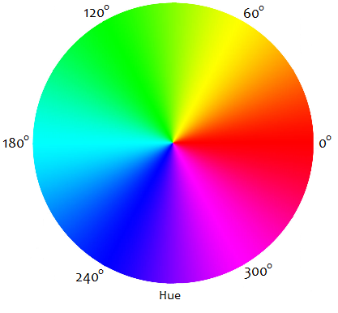

# 목차

- [목차](#목차)
- [1. 색상 표현](#1-색상-표현)
  - [1.1. RGB](#11-rgb)
  - [1.2. HSL](#12-hsl)
- [2. 배경 색과 이미지](#2-배경-색과-이미지)
  - [2.1. background-color](#21-background-color)
  - [2.2. background-image](#22-background-image)
  - [2.3. background-size](#23-background-size)

# 1. 색상 표현

웹에서 색상을 표현하는 방법에 대해서 정리한다.  

## 1.1. RGB

RGB는 삼원색에서 가산혼합에 해당한다. 빨간색, 초록색, 파란색 세 가지 색을 더해 색을 표현하는 방법이다.  

RGB는 각각 0부터 255 사이의 값이며, 표현하려는 색상에 각 값이 기여하는 정도를 나타낸다.  

투명도는 0부터 1사이의 값이다.  

```text
color: rgb(18, 204, 231);
color: rgba(18, 204, 231, 0.5);
```

## 1.2. HSL

Hue(색도): 0 ~ 360의 값
Saturation(채도): 0 ~ 100%의 값
Lightness(명도): 0 ~ 100%의 값



```text
hsl(360, 100%, 100%)
hsla(360, 100%, 100%, 0.2)
```

# 2. 배경 색과 이미지

배경을 넣는 방법에 대해 정리한다.  

## 2.1. background-color

```html
background-color: <색상>
```

## 2.2. background-image

요소에 배경을 넣을 수 있다.  

```html
background-image: url(path/to/image)
```

다음과 같이 배경을 넣어보자.  

```html
<style>
    body {
        background-image: url('images/bg.jpg');
    }
</style>
```

## 2.3. background-size

배경에 들어간 이미지 크기를 조절할 수 있다.  

```html
background-size: 속성값 | 크기값 | 백분율
```

|속성 값|설명|
|-|-|
|auto|배경 이미지 크기 만큼 표시(디폴트)|
|contain|요소 안에 다 들어오도록 변경|
|cover|요소에 꽉차도록|
|크기값|너비 높이|
|백분율|너비 높이|